# Dokumentasi Final Project Pemrograman Python Lanjut

## Latar Belakang "Presensi Universitas Amikom Yogyakarta Berbasis Face Recognition"
Latar belakang dari proyek Presensi Berbasis Face Recognition menggunakan Python dan Flask adalah untuk menyediakan solusi absensi yang lebih efisien. Metode absensi tradisional seperti mencatat absensi secara manual atau menggunakan sistem absensi berbasis sidik jari atau QR Code memiliki beberapa keterbatasan, seperti kesulitan dalam mengenali wajah atau kesulitan dalam menggunakan sistem absensi.

Pengenalan wajah menggunakan teknologi computer vision dan machine learning merupakan salah satu metode yang dapat digunakan untuk mengatasi keterbatasan-keterbatasan tersebut. Dengan menggunakan teknologi ini, sistem dapat dengan mudah mengenali wajah seseorang dan mencatat absensi.

Selain itu, menggunakan python dan flask juga sangat membantu dalam pengembangan sistem yang fleksibel dan mudah diintegrasikan dengan sistem lainnya. Python merupakan bahasa pemrograman yang sangat populer dan memiliki banyak library yang dapat digunakan untuk pengolahan citra dan pembelajaran mesin, sementara Flask merupakan framework yang digunakan untuk membuat aplikasi web yang ringan dan mudah digunakan.

### Nama Anggota Kelompok
1. Andi Muhammad Ichsan Jalaluddin (20.83.0545)
2. Raihan Rinto Andiansyah (20.83.0572)  
3. Satrio Bintang Pamungkas (20.83.0552)

<br/>
<br/>

## Gambaran "Presensi Universitas Amikom Yogyakarta Berbasis Face Recognition"

Projek Presensi Berbasis Face Recognition menggunakan Python dan Flask merupakan sebuah sistem yang dapat digunakan untuk mengenali wajah seseorang dan mencatat presensi. Proyek ini menggunakan bahasa pemrograman Python dan framework Flask untuk membuat aplikasi web yang akan digunakan sebagai antarmuka pengguna.

Sistem ini menggunakan algoritma K-Nearest Neighbors (KNN) untuk melakukan pengenalan wajah. Dalam proses pelatihan, sistem akan mengumpulkan data wajah yang dikenal dan label yang sesuai, kemudian melatih model KNN dengan data tersebut. Setelah melatih model, sistem dapat digunakan untuk mengenali wajah baru dan mencatat presensi.

Sistem ini akan dilengkapi dengan antarmuka web yang dapat digunakan oleh pengguna untuk mengecek presensi yang telah tercatat. Mendelegasikan semua kerja keras untuk [Presensi Universitas Amikom Yogyakarta Berbasis Face Recognition](https://github.com/satriobintang/Attendance-Using-Face-Recognition-Flask-Python).

## Dependencies

 - Flask 2.0.1 or greater

## Requirements and installation

In order to work, Attendance Using Face Recognition project is based on these following modules:

- cv2
- os
- flask
- datetime
- numpy
- sklearn
- pandas 

To install library, simply:

```bash
> pip install Flask
> pip install opencv-python
> pip install flask
> pip install numpy
> pip install scikit-learn
> pip install pandas
> pip install joblib
```

## Installation
You can download the repository and install manually by running:

```bash
> set FLASK_APP=app.py
> set FLASK_ENV=development
> flask run
```

Lakukan clone atau download repository terlebih dahulu.
<p align="center">
    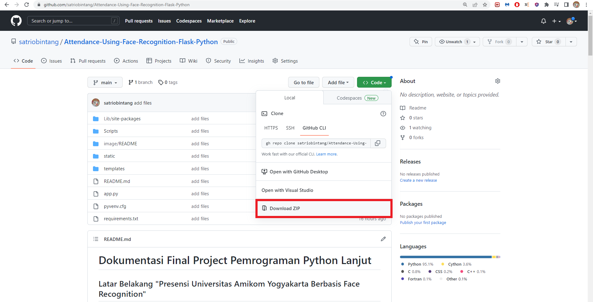
    <br>
 </p>
 
Ekstrak file zip setelah diunduh.
<p align="center">
    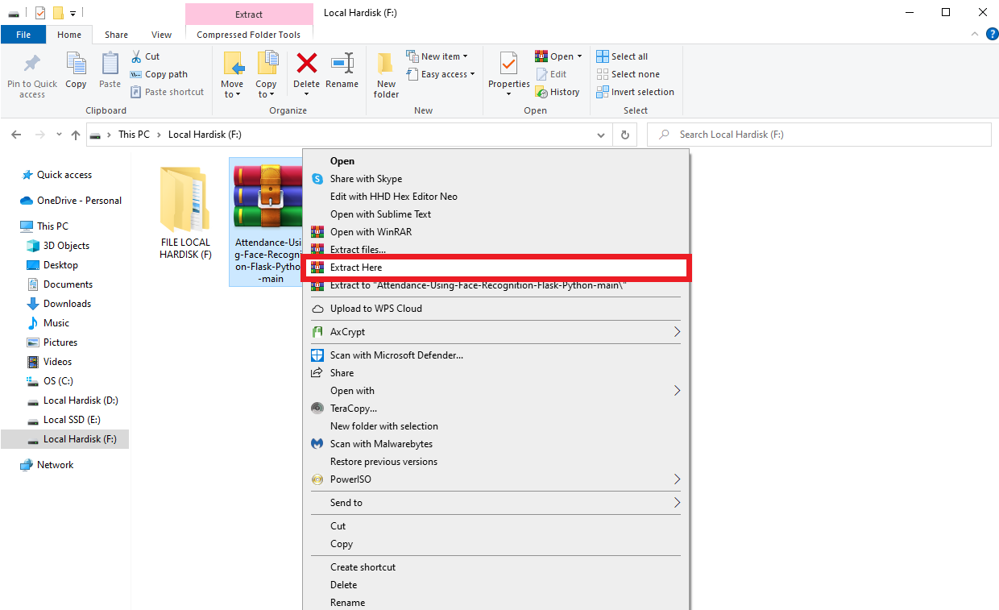
    <br>
 </p>
 
File sudah berhasil di ekstrak.
<p align="center">
    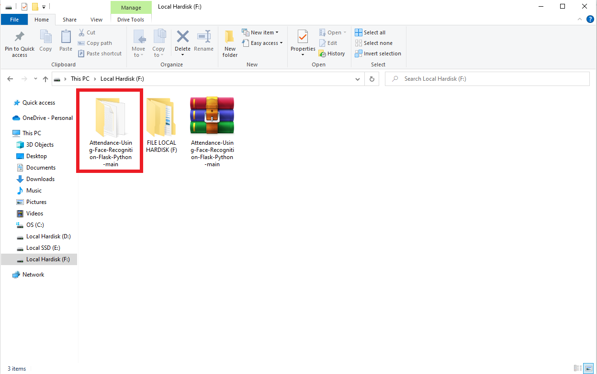
    <br>
 </p>
 
Pilih direktori lokasi.
<p align="center">
    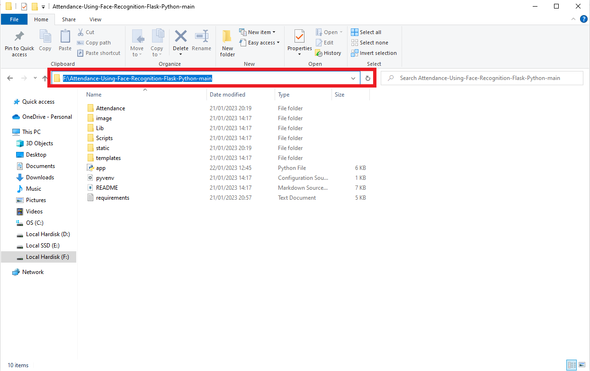
    <br>
 </p>
 
Buka Command Prompt (CMD) untuk melakukan perintah instalasi.
<p align="center">
    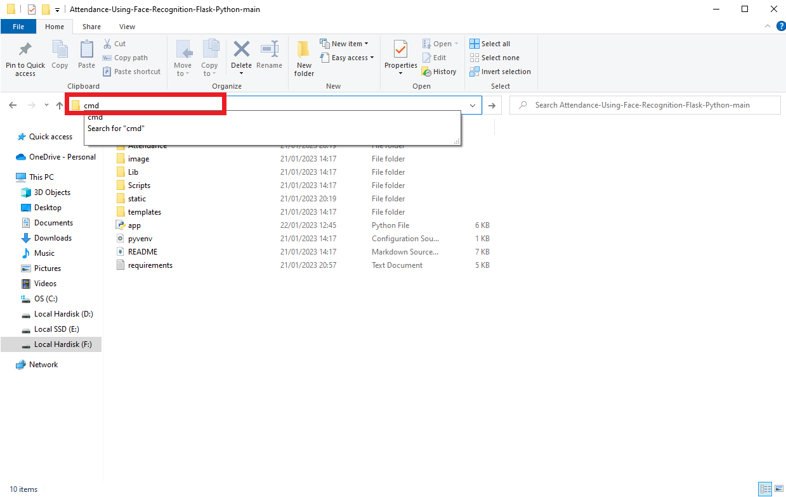
    <br>
 </p>
 
Cmd sekarang terbuka di lokasi direktori.
<p align="center">
    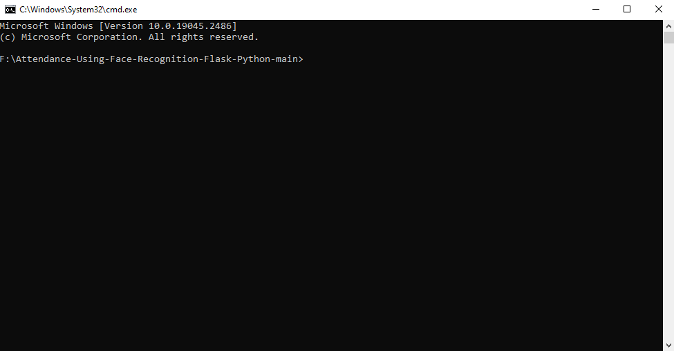
    <br>
 </p>

Gunakan perintah atau command "Scripts\activate".
<p align="center">
    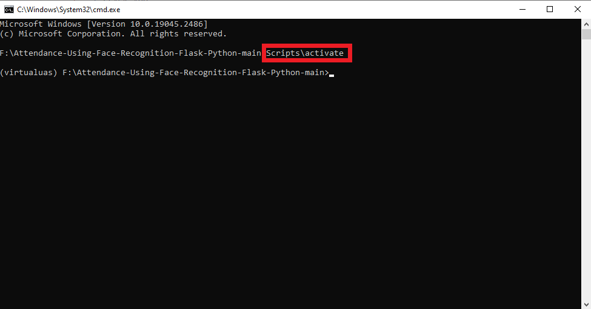
    <br>
 </p>

Gunakan perintah yang tertera pada instalasi.
<p align="center">
    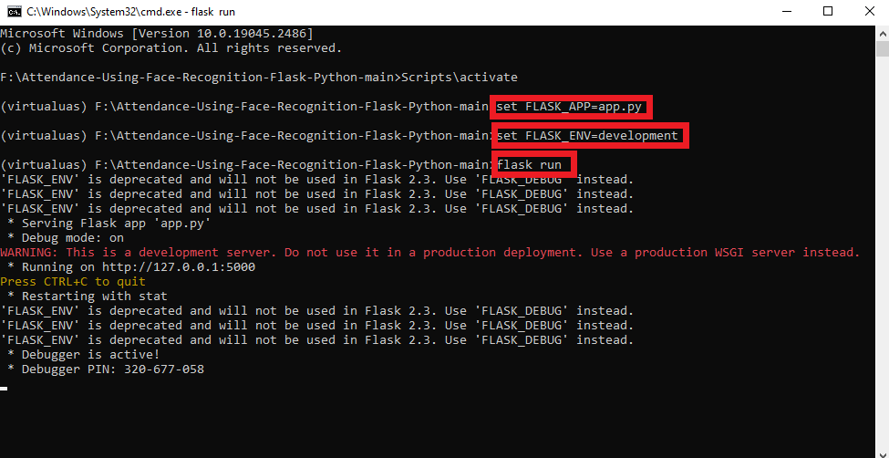
    <br>
 </p>

Salin ip address localhost seperti dibawah.
<p align="center">
    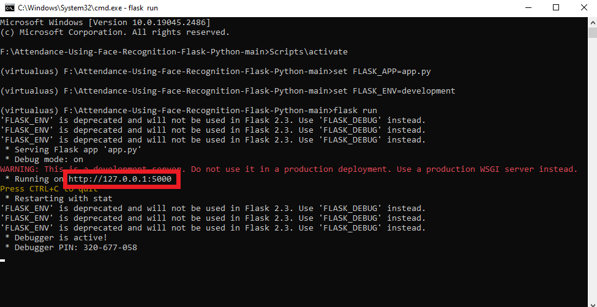
    <br>
 </p>

Buka tab browser dan tempelkan lalu tekan enter untuk mengakses.
<p align="center">
    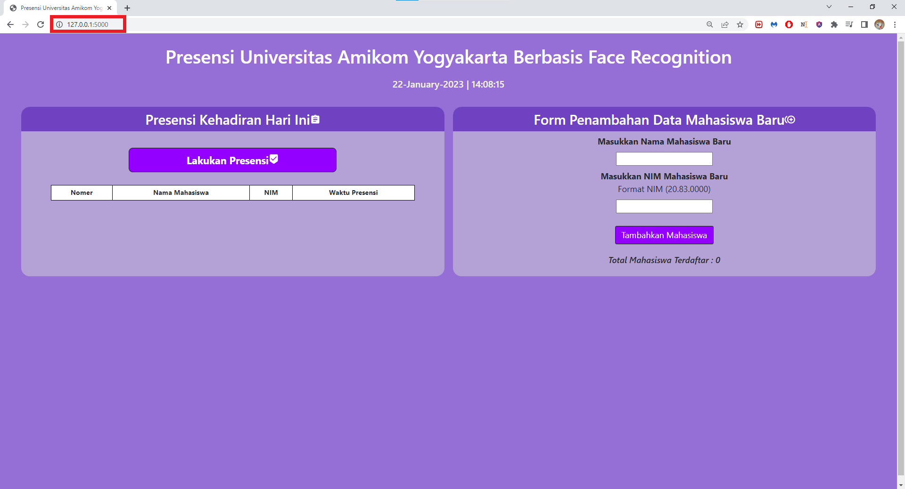
    <br>
 </p>
 
## Steps To Run 

- Make sure the device you are using has a camera or webcam
- Clone or download the repository
- Have [Python](https://www.python.org/downloads/) installed on your machine
- Download [Flask](http://flask.pocoo.org/)
- Start a local Flask web server
  - In a terminal or command prompt, navigate to the downloaded folder and run `python app.py`. (The flask docs have an alternate way of doing this.) 
  - In a browser, go to the URL indicated by `Running on http://XXX.X.X.X:YYYY/` 
- Enjoy

## Algorithms

Algoritma yang digunakan untuk melakukan Face Recognition (pengenalan wajah) adalah K-Nearest Neighbors (KNN). Algoritma ini digunakan untuk melakukan klasifikasi wajah baru dengan mengukur jarak antara fitur wajah baru dan fitur wajah yang dikenal, yang disimpan dalam sebuah model yang di-load dari file 'static/face_recognition_model.pkl' dan digunakan untuk memprediksi wajah yang diterima oleh fungsi 'identify_face'

## Project Documentation

Gambar di bawah ini adalah tampilan home pada projek "Presensi Universitas Amikom Yogyakarta Berbasis Face Recognition".
<p align="center">
    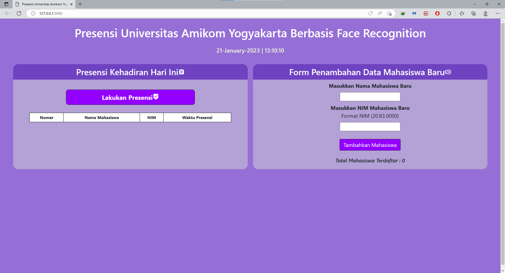
    <br>
 </p>

Gambar di bawah ini adalah contoh penggunaan program presensi menggunakan Face Recognition. Tahap awal untuk memulai, anda dapat melakukan input data mahasiswa terlebih dahulu dengan memasukkan Nama Mahasiswa dan NIM Mahasiswa pada form yang tersedia. Selanjutnya tekan tombol "Tambahkan Mahasiswa".
<p align="center">
    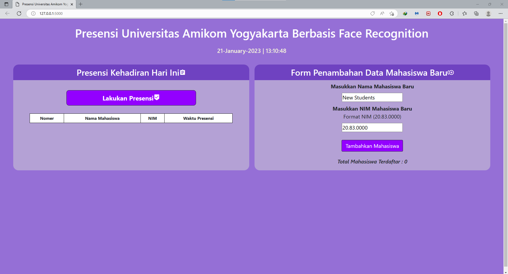
    <br>
 </p>
  
Gambar dibawah menunjukan kamera akan terbuka untuk melakukan pengambilan gambar wajah sebanyak 50. Gambar tersebut digunakan untuk data training untuk mengenali wajah yang akan melakukan presensi.
 <p align="center">
    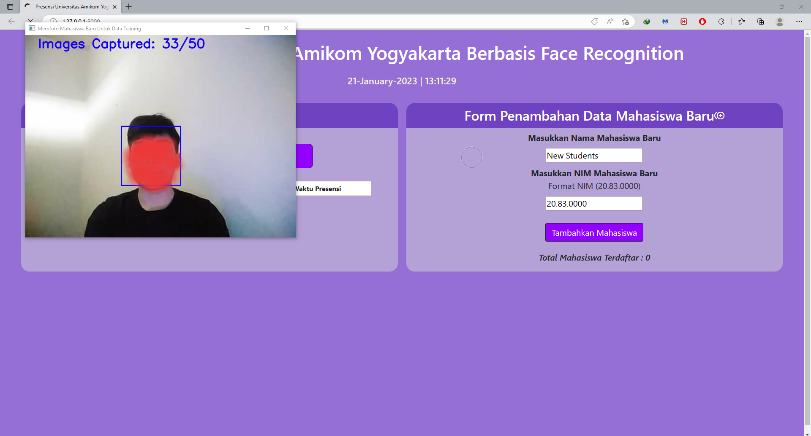
    <br>
 </p>

Gambar dibawah menunjukan "Total Mahasiswa Terdaftar" sudah bertambah, sebelumnya masih 0 sekarang bertambah menjadi 1.
 <p align="center">
    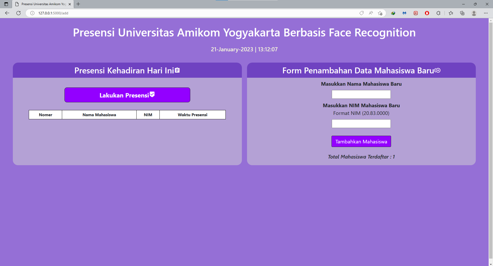
    <br>
 </p>

Gambar dibawah menunjukan langkah dalam presensi menggunakan face recognition. Untuk melakukan presensi bisa menekan tombol "Lakukan Presensi". Selanjutnya kamera akan terbuka untuk melakukan pengenalan wajah. Terdapat tulisan pada GUI kamera tersebut yang terdiri dari "Nama Mahasiswa_NIM" berwarna biru. Tekan tombol "ESC" untuk melakukan presensi.
  <p align="center">
    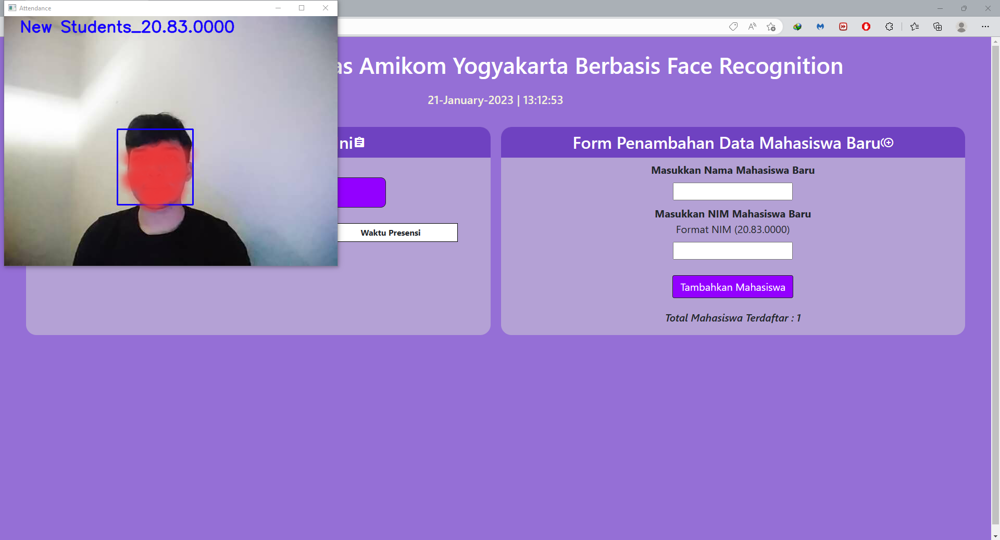
    <br>
 </p>
 
Gambar dibawah menunjukan tabel presensi mahasiswa yang terdiri dari "Nomer, Nama Mahasiswa, NIM, Waktu Presensi". Tabel tersebut berfungsi untuk menampilkan data yang sudah melakukan presensi. Dapat dilihat bahwa setelah melakukan presensi terdapat 1 data dari mahasiswa.
  <p align="center">
    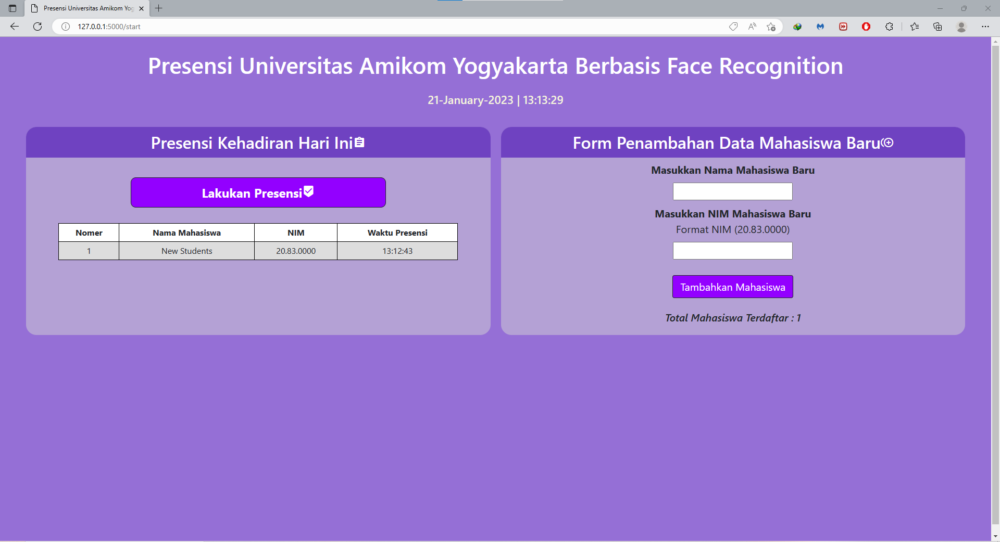
    <br>
 </p>


## Credits

Most of the work has been completed thanks to [Alt5chm3rz](https://github.com/satriobintang) (SatrioBintang), Andi, and Raihan. Focus of this project is to 'develop' it.

>I hope this project can be useful for many people. -Alt5chm3rz
